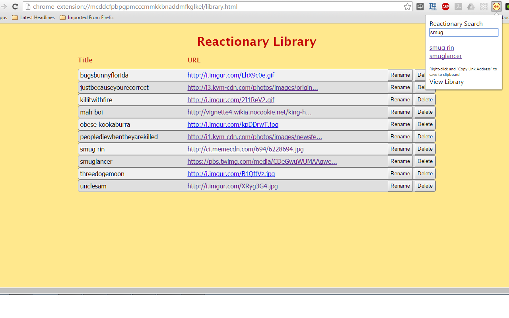

# Reactionary

Reactionary is a simple browser-based library for storing image urls for later use, like all your favorite reaction images. Right click an image to save it to the Reactionary library. Click on the extension icon to search for images by the title you've given them. Lastly, in the library page you can rename and delete saved image links.

Please follow standard image posting practices when using Reactionary. If the image is not from an image hosting service, reupload it to an image hosting site such as Imgur.com and save the link to the reuploaded image.

## Screenshot


## Implementation

Search triggers when the user stops typing for 500ms:
```javascript
//attach listener to keyup event
function addSearchListener(){
  var searchField = document.getElementById('search-field');
  searchField.addEventListener("keyup", searchOnIdle);
}

//set a new timeout, clearing out any existing timeout first
function searchOnIdle(){
  if (searchTimeout){
    clearTimeout(searchTimeout);
  }
  searchTimeout = setTimeout(searchDb, 500);
}
```

Saving a url to the indexedDB:
```javascript
function save(obj, success, error){
  var request = indexedDB.open(DB_NAME);

  request.onsuccess = function(e){
    var store = getObjectStore("images", 'readwrite');
    var requestAdd = store.add(obj);

    requestAdd.onsuccess = function(evt){
      success();
    };

    requestAdd.onerror = function(evt){
      error(evt.target.error.name);
    };
  };
}
```
## Upcoming features:
* Export and import library to and from files for backups
* Searchable library page
* Thumbnails

## Changelog:
Version 0.1.3:
  -fixed bug with entry deletion
